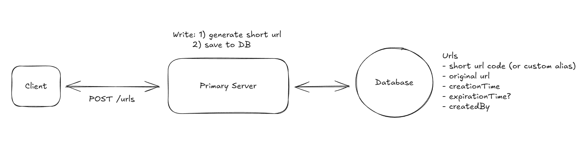
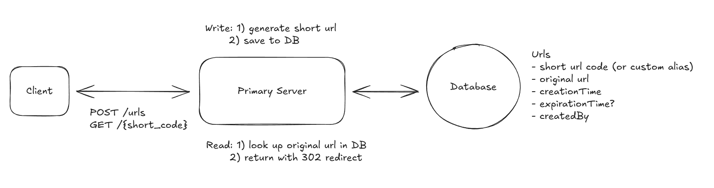
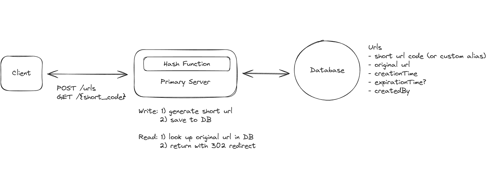
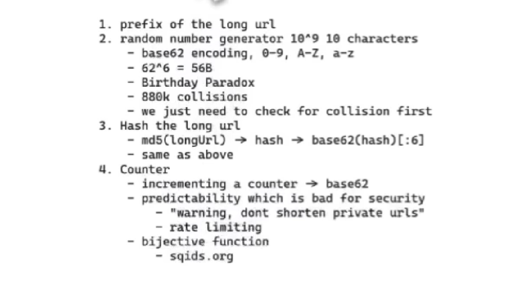
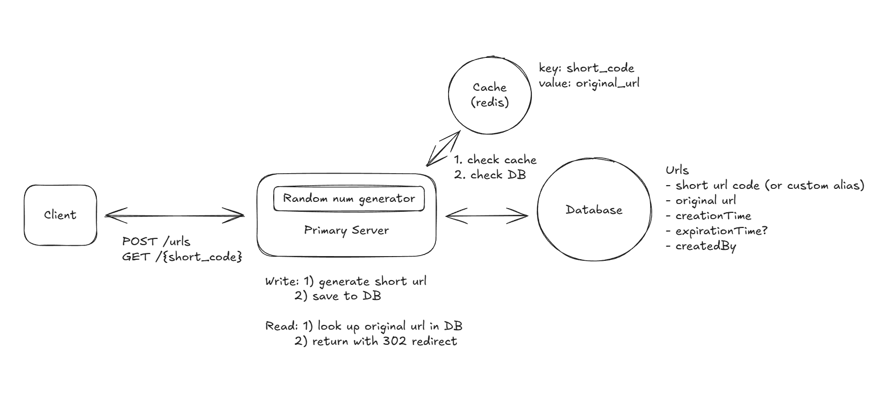
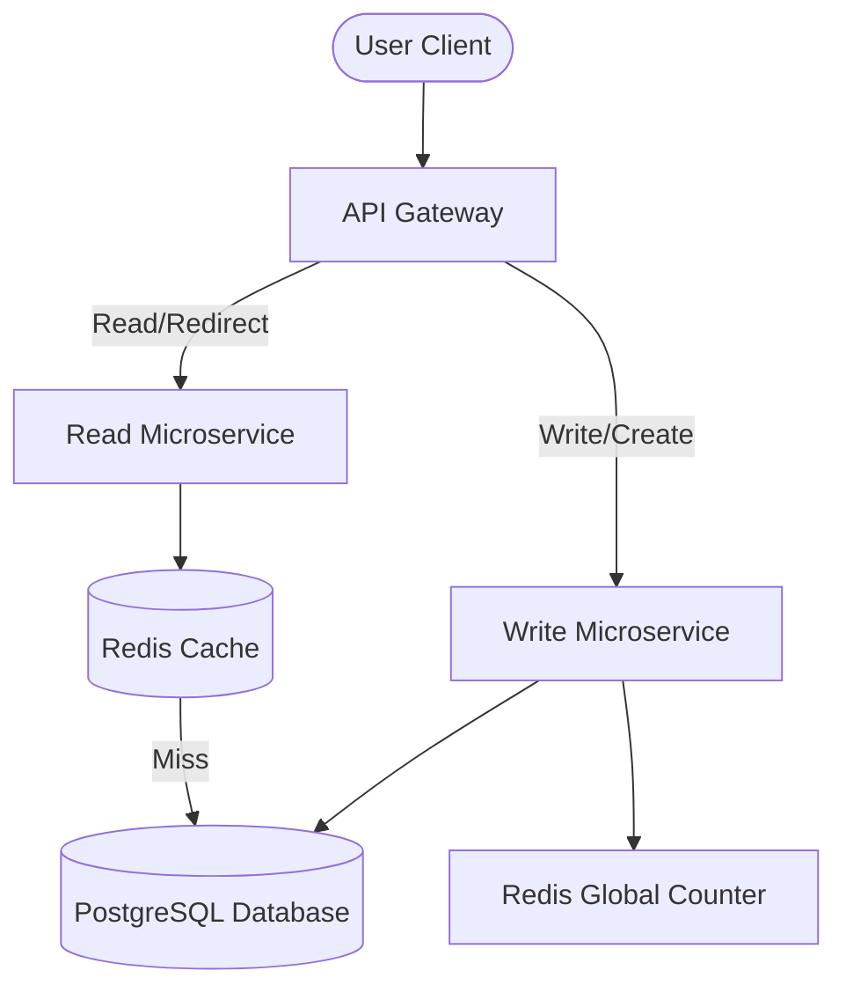

# URL Shortener System Design (Bit.ly)

Build a URL shortening service that converts long URLs into shorter, manageable links.

---

## 1. Understanding the Problem
Bit.ly is a URL shortening service that takes a long URL (e.g., `https://example.com/pages/detail?id=12345`) and returns a short, unique URL (e.g., `http://short.ly/abc123`). When a user accesses the short link, they are automatically redirected to the original long URL.

## 2. Requirements

### 2.1 Functional Requirements
- **URL Shortening**: Users should be able to submit a long URL and receive a shortened version.
- **Custom Aliases**: Optionally, users should be able to specify a custom alias for their shortened URL (e.g., `www.short.ly/my-custom-alias`).
- **Expiration Date**: Optionally, users should be able to specify an expiration date for their shortened URL.
- **Redirection**: Users should be able to access the original URL by using the shortened URL.

*Below the line (out of scope, but we will design/build it):*
- User authentication and account management.
- Analytics on link clicks (e.g., click counts, geographic data).

### 2.2 Non-Functional Requirements
- **Low Latency Redirection**: The redirection should occur with minimal delay (< 100ms, human-perceived real-time is ~200ms).
- **Scalability**: The system should scale to support 1 Billion shortened URLs and 100 Million Daily Active Users (DAU).
- **Uniqueness**: The system must ensure uniqueness for short codes (each short code maps to exactly one long URL).
- **High Availability**: The system should be highly reliable and available 99.99% of the time (Availability > Consistency).
- **CAP Theorem Tradeoff**: Partition tolerance is non-negotiable. For a URL shortener, we prioritize Availability over Consistency. Users sharing links do not require instantaneous global consistency; eventual consistency is acceptable.

*Below the line (out of scope, but might add):*
- Data consistency in real-time analytics.
- Advanced security features like spam detection and malicious URL filtering.

## 3. Core Entities
Initially, establishing key entities guides our API and database schema design.
- **Original URL**: The original long URL submitted by the user.
- **Short URL**: The shortened URL representation containing the unique short code.
- **User**: Represents the user who created the shortened URL.

## 4. API Design
The API endpoints map directly to our functional requirements.

### Shorten a URL
- **Endpoint**: `POST /urls`
- **Request Body**:
```json
{
  "long_url": "https://www.example.com/some/very/long/url",
  "custom_alias": "optional_custom_alias",
  "expiration_date": "optional_expiration_date"
}
```
- **Response Body**:
```json
{
  "short_url": "http://short.ly/abc123"
}
```

### Redirect to Original URL
- **Endpoint**: `GET /{short_code}`
- **Response**: `HTTP 302 Redirect` to the original long URL.

## 5. High-Level Design

### 5.1 Creating a Short URL
When a user submits a long URL:
1. The client sends a `POST` request to `/urls`.
2. The **Primary Server** validates the long URL format (e.g., using `is-url` style libraries).
3. *Deduplication Option*: Check if this exact long URL was already shortened to return the existing short code.
4. If valid, we generate a short code (abstracted temporarily as a unique generator).
5. Custom alias validation: If specified, verify it does not already exist. (To prevent collisions, custom aliases can be separated via namespace prefixes or stored in separate database tables).
6. Write the mapping (short code/custom alias, long URL, expiration date) to the database.
7. Return the short URL to the client.



### 5.2 Redirecting to the Original URL
When a user accesses the shortened URL:
1. The browser sends a `GET` request to our server with the short code (e.g., `GET /abc123` at the `short.ly` domain).
2. The server queries the database for the short code.
3. If found and not expired (current time < expiration time), retrieve the long URL. If expired, return `410 Gone`.
4. The server returns an HTTP redirect response to the browser.
5. A periodic background cleanup job deletes expired rows from the database. The cache TTL should align with or be shorter than the expiration times.



#### HTTP Redirect Types: 301 vs 302
- **301 (Moved Permanently)**:
  - Indicated to the browser that the resource has permanently moved.
  - Browsers cache this response, causing subsequent hits to bypass our servers entirely.
  - Response payload:
    ```http
    HTTP/1.1 301 Moved Permanently
    Location: https://www.original-long-url.com
    ```
- **302 (Found)**:
  - Indicates that the resource is temporarily located at a different URL.
  - Browsers do not cache this response, ensuring all subsequent requests hit our servers.
  - Response payload:
    ```http
    HTTP/1.1 302 Found
    Location: https://www.original-long-url.com
    ```
- **Design Decision**:
  - We choose **302 Redirect** because it allows us to track click statistics (critical for analytics), handle link expirations/updates dynamically, and easily identify issues if a link needs to be revoked or changed. 301 is only preferred if server scalability is the sole constraint and analytics are completely out of scope.

## 6. Deep Dives

### 6.1 Ensuring Short URL Uniqueness & Efficiency

#### 6.1.1 Bad Solution: Long URL Prefix
- **Approach**: Take the first $N$ characters (e.g., 8) of the long URL prefix (e.g., `www.linkedin.com/in/evan...` $\to$ `www.link`).
- **Issues**: High collision rates. Different paths on the same domain would generate identical short codes, breaking uniqueness.

#### 6.1.2 Hash Function (SHA-256 + Base62)
- **Approach**: Use a cryptographic hash (like SHA-256) on the canonical URL, encode the output using Base62, and take the first 8 characters.
  - *Base62*: Consists of `[a-zA-Z0-9]` (62 characters). Excludes `+` and `/` to avoid URL path and query-string encoding issues.
- **Example Flow**:
  ```python
  input_url = "https://www.example.com/some/very/long/url"
  canonical_url = canonicalize(input_url)  # normalize host, ports, slashes
  hash_code = hash_function(canonical_url)
  short_code_encoded = base62_encode(hash_code)
  short_code = short_code_encoded[:8]      # 8 characters (62^8 ~ 218 Trillion combinations)
  ```
- **Collisions & Safety**: While low, collisions can occur. We place a `UNIQUE` constraint on the short code column. If a write fails due to duplicate key, we append a random salt to the URL and hash again (up to 3-5 retries).

#### 6.1.3 Unique Counter with Base62 Encoding
- **Approach**: Increment a global counter for every new URL and encode the integer using Base62.
  - Redis is perfect for storing the counter: it is single-threaded, and the atomic `INCR` command guarantees uniqueness without race conditions.
  - *Capacity math*:
    - 1 Billion URLs in Base62 $\to$ 6 characters (`15ftgG`).
    - $62^6 \approx 56\text{ Billion}$ URLs capacity.
    - $62^7 \approx 3.5\text{ Trillion}$ URLs capacity.
- **Security Vulnerability**: Sequential counters make URLs predictable (enumeration attacks). Competitors could scrape active URLs or count user sign-ups.
- **Remedies**:
  - Implement rate limiting.
  - Apply a reversible transformation (like XORing with a secret key) before encoding.
  - Use bijective functions or external libraries like **Sqids (sqids.org)** to obfuscate the sequential counter, preventing competitor guessing while avoiding database lookup checks.





### 6.2 Fast Redirection Optimizations
Redirection queries must be lightning-fast. A simple full table scan will fail at scale.

#### 6.2.1 B-Tree Indexing (Database Level)
- **Approach**: Set the `short_code` column as the Primary Key or add a B-tree (or Hash index) to the column. Hash indexes outperform B-Tree for exact match queries (`O(1)` vs `O(log N)`).
- **Scale Limits**:
  - $100\text{M DAU} \times 5\text{ redirects/user/day} = 500\text{M redirects/day}$.
  - Average QPS: $\approx 5,787\text{ QPS}$. Peak QPS (100x spike capability): $\approx 600\text{K QPS}$.
  - A single disk-bound database cannot handle $600\text{K QPS}$.

#### 6.2.2 In-Memory Caching (Redis)
- **Approach**: Introduce a Redis/Memcached layer between the App Server and Database.
- **Cache Policy**: Store mapping of `short_code -> long_url`.
- **Latency comparison**:
  - Memory: $\approx 100\text{ ns}$ (Millions of reads/sec)
  - SSD: $\approx 0.1\text{ ms}$ ($\approx 100\text{K IOPS}$)
  - HDD: $\approx 10\text{ ms}$ ($100\text{-}200\text{ IOPS}$)
- **Eviction**: Use Least Recently Used (LRU) policy. Clean up memory by automatically evicting cold URLs.



#### 6.2.3 CDN and Edge Computing (Cloudflare Workers / AWS Lambda@Edge)
- **Approach**: Cache redirects at PoPs (Points of Presence) close to the users. Deploy redirect logic directly to CDN Edge Workers.
- **Tradeoff**: Very low latency, but makes tracking analytics hard because requests do not hit the origin server. If analytics are required, avoid edge caching or use async log aggregation from edge to origin.

### 6.3 Scaling to 1B Shortened URLs and 100M DAU

#### Database Capacity Calculation
- **Row Size**:
  - `short_code`: 8 bytes
  - `long_url`: 100 bytes
  - `creation_time`: 8 bytes
  - `custom_alias`: 100 bytes
  - `expiration_date`: 8 bytes
  - Metadata / IDs: 276 bytes
  - **Total**: $\approx 500\text{ bytes per row}$.
- **Storage for 1B rows**: $500\text{ bytes} \times 1\text{ Billion} = 500\text{ GB}$.
- A single PostgreSQL/MySQL instance can easily handle 500 GB on modern SSDs. We do not need complex sharding initially.
- **Write load**: Assuming 100K new URLs created daily, that is $\approx 1.15\text{ writes/sec}$. Write volume is trivial; reads are the primary bottleneck.

#### Availability & Architecture



- **Microservice Split**: Separate the system into a **Read Service** (scales horizontally to handle 600K QPS redirects) and a **Write Service** (handles writes, low throughput).
- **Distributed Counters (Redis Counter Batching)**:
  - To prevent multiple Write Service instances from colliding on the counter, use a centralized Redis instance.
  - To reduce network overhead, use **counter batching**: Each Write Service worker requests a block of 1,000 values (using atomic increment by 1,000), caching and utilizing them locally.
- **Database Replication**: Set up Postgres Primary-Replica replication. Writes go to the Primary; Reads are served by Replicas.
- **Redundancy & Backups**:
  - Snapshot the database hourly and back it up to cold storage (S3).
  - Snapshot Redis periodically. If Redis fails, the database `UNIQUE` constraints keep the system safe, though a small range of batched counter values might be skipped (safe since we only require uniqueness, not sequential continuity).
- **Multi-Region Counter Allocation**: Allocate disjoint counter ranges to regional clusters (e.g., Region A gets `0 - 1B`, Region B gets `1B - 2B`) to completely avoid cross-region write synchronization.
